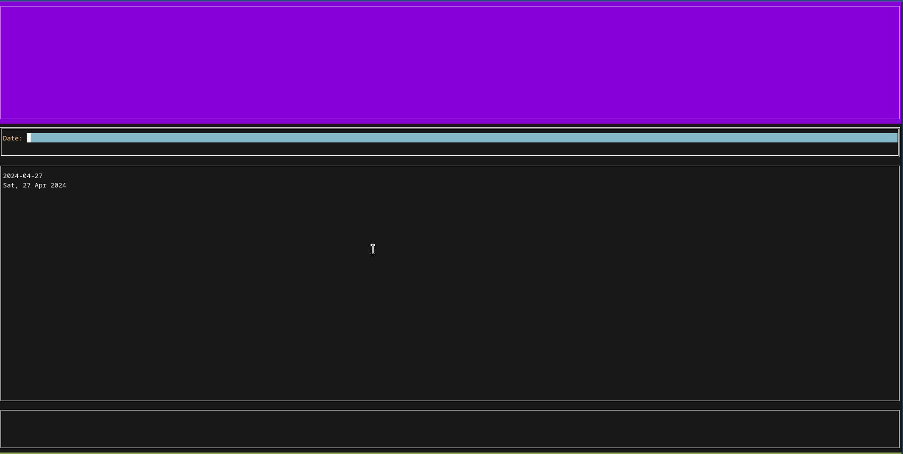

# AddLedger

AddLedger is a Terminal User Interface (TUI) to help you add new
entries on [hledger](https://hledger.org/). It's inspired in the
amazing [hledger-iadd](https://github.com/hpdeifel/hledger-iadd).

## Mandatory Gif


Result:

```
2023-11-20 Taxi to airport
    assets:bank:current:lacaixa    EUR -20
    expenses:trips-and-travels    EUR 20

2023-11-25 Restaurant  ; trips:paris
    liabilities:credit-cards:amex    EUR -25
    expenses:leisure:restaurant-and-food    EUR 25

2023-11-26 Bus on Paris  ; trips:paris
    liabilities:credit-cards:amex    EUR -20
    expenses:public-transportation    EUR 20
```

## Installing

You can get the latest binary for your platform from our [releases
page](https://github.com/vitorqb/addledger/releases). Copy it on your
path and run it.

## Usage

```
$ addledger --help
Usage of addledger:
      --csv-statement-file string       CSV file to load as a statement.
      --csv-statement-preset string     Preset to use for CSV statement. If a simple filename is given, it will be searched in ~/.config/addledger/presets (with a .json extension).
  -d, --destfile string                 Destination file (where we will write). Defaults to the ledger file.
      --hledger-executable string       Executable to use for HLedger (default "hledger")
      --ledger-file string              Ledger File to pass to HLedger commands. If empty let ledger executable find it.
      --logfile string                  File where to send log output. Empty for stderr.
      --loglevel string                 Level of logger. Defaults to warning. (default "WARN")
      --printer-line-break-after int    Number of line breaks to print after a transaction. (default 1)
      --printer-line-break-before int   Number of line breaks to print before a transaction. (default 1)
```

A typical usage would be

```
# Normal usage (with `hledger` executable)
$ addledger

# With a custom file
$ addledger --ledger-file ~/my-custom-hledger.journal

# Or with env vars
$ export ADDLEDGER_LEDGER_FILE=~/journal
$ addledger
```

Note that the file must exist.

### CSV Statements

Most bank allow exporting statements using csv files. These statements
usually have at least 3 columns that may interest us: date,
description and value. AddLedger has a tool to read those statement
files and suggest entries for a posting's date, description and
ammounts.

For example, take this example CSV:

```
"27/09/2023","PHARMACY",8
"27/09/2023","SUPERMARKET",53.73
"28/09/2023","CLOTHES",8.14
```

**NOTE**: This feature doesn't (yet) support CSV headers.

We need to tell AddLedger how to read the information from this CSV. We will
do so using a *json preset file*, like this:

```js
{
  "separator": ",",           // CSV separator to use
  "account": "assets:bank",   // Default account to use for all statements
  "commodity": "EUR",         // Commodity to use for all statements
  "dateFieldIndex": 0,        // 0-based index for which column to read date from
  "dateFormat": "01/02/2006", // Date format to use. Based on the date 2006-02-01 (like golang)
  "descriptionFieldIndex": 1, // 0-based index for which column to read the description from
  "accountFieldIndex": -1,    // 0-based index for which column to read account from. (-1) means no column.
  "ammountFieldIndex": 2      // 0-based index for which column to read the ammount from.
}
```

Note that for any index, you can use `-1` for telling AddLedger not to
read this information.

#### Loading at start time

New let's assume that:

1. Your csv statement file is in `~/statement.csv`
2. Your json preset file is in `~/presets/mypreset.json`

You can then tell AddLedger to start using this `.csv` and `.json` like this:

```
addledger --csv-statement-file=~/statement.csv --csv-statement-preset=mypreset
```

**NOTE**: You your statement file is in other folder you can a full or relative
path to it, like `--csv-statement-preset=~/preset.json`.

#### Loading at runtime

Inside the UI, you can press `CRTL+Q l` to load a statement at runtime:



#### Specifying Presets

If you specify only the name of a file when prompted for a preset, addledger
will look for a file with that name into `$HOME/.config/addledger/presets`. If
the file exists (with or without a `.json` suffix), it will be used.

If you don't specify a preset (both in the CLI as well as in the UI), addledger
will look for a `default.json` file inside your presets folder.

### Entering transactions with multiple commodities

If you want to enter a transaction with many commodities, in order to
finish entering posting accounts, press `ALT+Enter`.

### Entering amounts

When entering posting amounts, you can:

1. Enter just the number (and use default commodity)

```
123   # => EUR 123
```

2. Enter commodity + number

```
USD 123  # => USD 123
```

3. Enter a fraction (when there is a pending balance for the transaction)

```
# acc1   EUR 120
# acc2   _______
1/3  # => EUR 40
```

## Development

### Setup

You will need to install and enabled https://github.com/asdf-vm/asdf.
You may also want to install https://direnv.net/ to automatically read the `.envrc` file.

Then for setting up development:

```
just setup
```

If you don't have `direnv`, then also source the file:

```
source .envrc
```

### Testing

```
# All
just test

# A single file
just test internal/utils/utils_test.go 
```

### Linting and Formatting

For running linting and formatting:

```
just format lint
```

### Useful commands

```
# Gets the transactions as a json and pipe to jq
hledger print --output-format=json | jq .
```

## Configuration

All configuration variables can be set with command line flags or
environmental variables. Env vars must be prefixed with
`ADDLEDGER_`. For example: `--destfile=foo` is the same as `export
ADDLEDGER_DESTFILE=foo`.

To see all see the output of `--help`.
