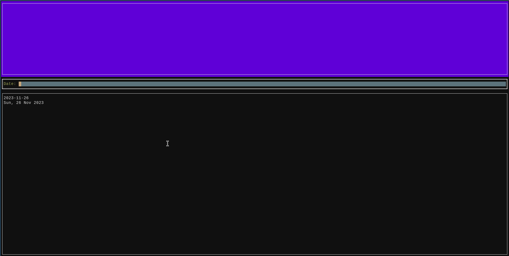

# AddLedger

AddLedger is a Terminal User Interface (TUI) to help you add new
entries on [hledger](https://hledger.org/). It's inspired in the
amazing [hledger-iadd](https://github.com/hpdeifel/hledger-iadd).

## Mandatory Gif



Result:

```
2023-08-30 Gift to Mother
    assets:bank-account    EUR -22
    expenses:gifts    EUR 22

2023-08-30 Restaurant
    assets:bank-account    EUR -50
    expenses:leisure:restaurants    EUR 50

2022-01-01 Plane tickets to Brasil
    assets:bank-account    BRL -2000
    expenses:trips    BRL 2000

2022-12-31 Gift to Mother
    assets:bank-account    EUR -22
    expenses:gifts    EUR 22
```

## Installing

You can get the latest binary for your platform from our [releases
page](https://github.com/vitorqb/addledger/releases). Copy it on your
path and run it.

## Usage

```
$ addledger --help
Usage of addledger:
  -d, --destfile string                 Destination file (where we will write)
      --hledger-executable string       Executable to use for HLedger (default "hledger")
      --ledger-file string              Ledger File to pass to HLedger commands
      --logfile string                  File where to send log output. Empty for stderr.
      --loglevel string                 Level of logger. Defaults to warning. (default "WARN")
      --printer-line-break-after int    Number of line breaks to print after a transaction. (default 1)
      --printer-line-break-before int   Number of line breaks to print before a transaction. (default 1)
```

A typical usage would be

```
# With normal ~/.hledger.journal file
$ addledger -d ~/.hledger.journal

# With a custom file
$ addledger -d ~/my-custom-hledger.journal --ledger-file ~/my-custom-hledger.journal

# Or with env vars
$ export ADDLEDGER_DESTFILE=~/journal
$ export LEDGER_FILE=~/journal
$ addledger
```

Note that the file must exist.

### Entering transactions with multiple commodities

If you want to enter a transaction with many commodities, in order to
finish entering posting accounts, press `ALT+Enter`.

## Development

### Setup

You will need to install and enabled https://github.com/asdf-vm/asdf.

Then for setting up development:

```
just setup
```

**REMEMBER** that you need to source the `.env` file for configuring
the app during development:

```
source .env
```

### Testing

```
# All
just test

# A single file
just test internal/utils/utils_test.go 
```

### Linting and Formatting

For running linting and formatting:

```
just format lint
```

### Useful commands

```
# Gets the transactions as a json and pipe to jq
hledger print --output-format=json | jq .
```

## Configuration

All configuration variables can be set with command line flags or
environmental variables. Env vars must be prefixed with
`ADDLEDGER_`. For example: `--destfile=foo` is the same as `export
ADDLEDGER_DESTFILE=foo`.

To see all see the output of `--help`.
